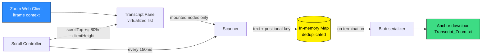

# Zoom Transcript Extractor

### Automated transcription extraction for the Zoom Web Client — powered by direct DOM manipulation, not native export functions

*Bypass UI restrictions: scroll, extract, aggregate, and export in a single autonomous execution.*

[](https://developer.mozilla.org/en-US/docs/Web/JavaScript)
[](https://zoom.us/wc)
[](https://developer.mozilla.org/en-US/docs/Web/API/Document_Object_Model)
[](https://github.com/yannbellec/zoom_scrapper)
[](https://github.com/yannbellec/zoom_scrapper)
[](https://github.com/yannbellec/zoom_scrapper/blob/main/LICENSE)
[](http://makeapullrequest.com)
[](https://github.com/yannbellec/zoom_scrapper)

[**Quick Start**](#quick-start) · [**Why this exists**](#why-this-exists) · [**Architecture**](#architecture) · [**Safety**](#safety) · [**Disclaimer**](#disclaimer)

---

## Why this exists

Zoom frequently restricts native transcript exporting within its desktop application. When a host disables the "Save Transcript" permission, the live captions still appear on your screen, but the button that would let you keep a copy of them is simply gone. Anyone who relies on those captions for note-taking, for accessibility reasons, or for reviewing a long technical meeting afterwards loses access to the record the moment the call ends.

This repository provides a client-side workaround that runs entirely in your own browser. Instead of asking Zoom for permission through its API, the script reads the page directly. It captures the caption text from the Document Object Model as the transcript panel renders it, and it does so before the browser discards those elements to save memory.

The result is a plain text file containing every caption line that was displayed to you during the meeting, exported with a single execution and no external software.

---

## Features

- **Full-history capture** — walks the entire transcript panel from top to bottom, not just the portion currently visible on screen.
- **Virtualized list handling** — collects text nodes as they are mounted and stores them before the browser unmounts them.
- **Automatic deduplication** — every captured block is keyed and stored in a `Map`, so repeated passes over the same region never duplicate a line.
- **Single-execution workflow** — you paste the script once, and it scrolls, extracts, aggregates, and downloads without any further interaction.
- **Zero dependencies** — pure Vanilla JavaScript, no libraries, no build step, no browser extension to install.
- **Fully local** — nothing leaves your machine; there is no network call anywhere in the script.
- **Plain text output** — the export is a readable `.txt` file that any editor, note-taking app, or downstream summarization tool can open.
- **Non-destructive** — the script only reads elements and changes the scroll position of one panel; it never modifies the meeting or the Zoom client itself.
- **Configurable timing** — the scroll interval and step size are exposed as constants, so slow connections and very long meetings can be accommodated.

---

## How it works: the virtualization problem

Most naive attempts at this task fail for the same reason, and it is worth explaining why.

Zoom renders its transcript panel as a **virtualized list**. A virtualized list only keeps in the DOM the handful of elements that fit inside the visible viewport. As you scroll down, new caption blocks are created and inserted, while the blocks that have scrolled out of view are destroyed and removed from the document entirely. This is a deliberate performance optimization: a three-hour meeting can produce several thousand caption lines, and holding all of them in the DOM at once would make the browser sluggish.

The practical consequence is that a simple query such as `document.querySelectorAll('.lt-full-transcript__item')` will only ever return the ten or twenty blocks that happen to be on screen at that instant. Everything above and below is not merely hidden, it does not exist in the document at all.

The extractor resolves this by taking control of the scroll container itself. It advances the panel in small increments, and after each increment it immediately scans whatever is currently mounted and copies that text into a persistent `Map` held in memory. Because the loop moves in steps smaller than one full viewport height, consecutive scans overlap, which guarantees that no block slips past between two passes. The `Map` key is derived from the block's text content and its computed positional CSS offset, so a line that is scanned twice is stored once.

```
// Conceptual: why an in-memory accumulator is required
const store = new Map();                       // survives across scroll steps
const visible = panel.querySelectorAll(ITEM);  // only what is mounted right now
visible.forEach(node => store.set(keyFor(node), node.innerText));
panel.scrollTop += panel.clientHeight * 0.8;   // advance, overlap by 20%
```

By the time the container reaches its maximum scroll height, the `Map` holds the complete transcript even though the DOM never held more than a fraction of it at any single moment.

---

## Architecture



A single JavaScript execution running a deterministic cycle loop:

```
┌─────────────────────────────────────────────────────────────┐
│  every 150ms:                                               │
│  1. check current scroll position against max scroll height │
│  2. scan active transcript nodes (.lt-full-transcript__item)│
│  3. extract text and compute positional CSS keys            │
│  4. append unique transcript blocks to a global Map object  │
│  5. increment scroll height by 80% of the client height     │
│  6. await DOM render and frame update                       │
│  7. on termination, flush Map state to a Blob text string   │
│  8. trigger automated anchor download (Transcript_Zoom.txt) │
└─────────────────────────────────────────────────────────────┘
```

The loop terminates when the scroll position stops advancing, which means the bottom of the panel has been reached. A small stall counter guards against a panel that briefly reports the same position while new content is still loading, so the script waits for several consecutive identical readings before it decides the transcript is complete.

---

## Quick Start

### 1. Join the meeting in a browser

Open the meeting invitation link and choose **"Join from Your Browser"** rather than launching the desktop application. The script depends on the Zoom Web Client, because only the web version exposes the transcript panel as ordinary DOM elements.

### 2. Open the transcript panel

Inside the meeting interface, open the transcript or live-caption side panel and leave it visible. The script needs the panel to be mounted before it starts.

### 3. Open the browser console

Open your browser's Developer Tools and switch to the **Console** tab.

```
macOS    Cmd + Option + I
Windows  Ctrl + Shift + I  (or F12)
Linux    Ctrl + Shift + I
```

### 4. Switch the execution context to the Zoom iframe

This is the step people miss most often. The Zoom Web Client renders the meeting inside an iframe, so the default top-level context cannot see the transcript elements at all.

In the dropdown at the top of the Console panel (labelled `top` by default), select the Zoom frame instead. Chrome and Edge show this as a context selector; Firefox exposes the same thing through the frame-selection icon in the toolbar of the Console.

### 5. Paste and run

Copy the contents of `extract_transcript.js` into the console and press Enter. The panel will begin scrolling on its own. Leave the window in the foreground and do not scroll manually while it runs, because manual scrolling competes with the script's own scroll control.

When the panel reaches the bottom, your browser will download `Transcript_Zoom.txt` automatically.

```
[extractor] context OK — transcript panel found
[extractor] scrolling... 412 / 3180 px   captured: 37 blocks
[extractor] scrolling... 1650 / 3180 px  captured: 154 blocks
[extractor] scrolling... 3180 / 3180 px  captured: 289 blocks
[extractor] bottom reached — flushing 289 unique blocks
[extractor] download triggered: Transcript_Zoom.txt
```

---

## Configuration

The tunable values are declared as constants at the top of the script. Edit them in place before pasting if the defaults do not suit your meeting.

| Constant | Default | Description |
| --- | --- | --- |
| `TICK_MS` | `150` | Milliseconds between two cycles. Increase this on a slow machine or a slow connection, so the panel has time to render new blocks before the next scan. |
| `SCROLL_RATIO` | `0.8` | Fraction of the panel height to advance per step. Values below `1.0` create an overlap between consecutive scans; lowering it further is safer but slower. |
| `ITEM_SELECTOR` | `.lt-full-transcript__item` | CSS selector for a single caption block. Change this if Zoom updates its class names. |
| `PANEL_SELECTOR` | `.lt-full-transcript__list` | CSS selector for the scrollable container that holds the blocks. |
| `STALL_LIMIT` | `5` | Number of consecutive cycles with no scroll progress before the script concludes it has reached the bottom. |
| `OUTPUT_NAME` | `Transcript_Zoom.txt` | Filename used for the downloaded export. |
| `INCLUDE_SPEAKERS` | `true` | When true, the speaker name and timestamp are kept alongside each line. When false, only the spoken text is exported. |

---

## Output format

The export is a plain UTF-8 text file. Each captured block is written on its own line, in the order it appeared in the panel:

```
10:04:12  Rachel Smith: let's start with the stimulation protocol from last week
10:04:19  Rachel Smith: the response amplitudes were noisier than expected
10:04:31  Yann Bellec: that matches what I saw on the second electrode array
```

If `INCLUDE_SPEAKERS` is set to `false`, the same transcript is written without the leading timestamp and speaker column, which is usually more convenient when the text is going to be pasted into a summarization tool.

---

## Repo structure

```
zoom_scrapper/
├── extract_transcript.js   # the script you paste into the console
├── README.md
└── LICENSE
```

The whole tool is one file on purpose. There is no build step and nothing to install, because anything more complex would defeat the point of a snippet you can paste into a console in the middle of a meeting.

---

## Troubleshooting

A few failure modes account for almost every problem people run into.

- **"Cannot read properties of null" immediately after pasting.** The console is almost certainly still pointing at the top-level document instead of the Zoom iframe. Go back to step 4 of the Quick Start and change the execution context.
- **The script runs but captures nothing.** Zoom has likely changed its class names. Inspect one caption block with the element picker, read its actual class attribute, and update `ITEM_SELECTOR` and `PANEL_SELECTOR` accordingly.
- **The transcript has gaps.** The scroll step is outrunning the render. Increase `TICK_MS` to give the panel more time, or lower `SCROLL_RATIO` so consecutive scans overlap more heavily.
- **The script stops early on a long meeting.** Zoom loads older captions lazily when you scroll near the top. Scroll the panel manually to the very top once before running the script, wait for the loading indicator to finish, and then start it.
- **Nothing downloads at the end.** Some browsers block programmatic downloads on a page you have not interacted with. Click once anywhere inside the page before running the script.
- **The meeting ended before I ran it.** The captions only live in the DOM while the meeting is open. Once you leave the call, the panel is gone and there is nothing left to read.

---

## Safety

- **Zero dependencies.** The script is pure Vanilla JavaScript. It loads nothing, installs nothing, and requires no browser extension.
- **Local execution.** No data is sent to external servers or third-party APIs. The extraction happens entirely within your local browser memory, and the file is written by your own browser's download mechanism.
- **No credentials involved.** The script never touches cookies, tokens, session storage, or any authentication material. It reads rendered text and nothing else.
- **Non-destructive.** The script only reads DOM elements and modifies the scroll position of a single panel. It does not alter the Zoom web client's core functionality, does not intercept network traffic, and does not change anything for other participants.
- **Nothing hidden from the host.** The tool captures only what is already displayed on your own screen. It does not unlock captions that were never generated, and it does not grant access to a meeting you are not in.

---

## Roadmap

- [ ] Optional export to Markdown and to WebVTT for subtitle workflows
- [ ] Speaker-grouped output that merges consecutive lines from the same person
- [ ] Configuration through a small in-page overlay rather than editing constants
- [ ] Resilience layer that resolves the panel by structure instead of by class name
- [ ] Optional bookmarklet packaging for one-click execution

PRs warmly welcome.

---

## Contributing

Genuine contributions are appreciated. Particularly:

- Updated selectors when Zoom ships a new web client build
- Output formatters for other transcript formats
- Better handling of very long meetings where captions load lazily
- Tested behaviour reports on Firefox and Safari, which are less well covered than Chrome

Open an issue with your browser version and the Zoom web client build if you hit a selector that no longer matches.

---

## Disclaimer

**This tool is intended for personal record-keeping and accessibility purposes.** It captures only the caption text that Zoom has already rendered on your own screen, in a meeting you have legitimately joined.

You remain responsible for how you use the resulting file. Consent and recording laws differ substantially between jurisdictions, and some of them treat a saved transcript the same way they treat an audio recording. Many universities, hospitals, and employers also impose their own data-retention and confidentiality rules that are stricter than the law. Before you keep, share, or process a transcript, confirm that you are allowed to, and consider telling the other participants that you are keeping a copy.

The authors carry no liability for how this software is used, for any breach of a platform's terms of service, or for any consequence arising from the retention or distribution of meeting content.

---

## License

[MIT](https://github.com/yannbellec/zoom_scrapper/blob/main/LICENSE) © [yannbellec](https://github.com/yannbellec)

---

### If this saved you from re-watching a two-hour recording, please star the repo — it genuinely helps.
